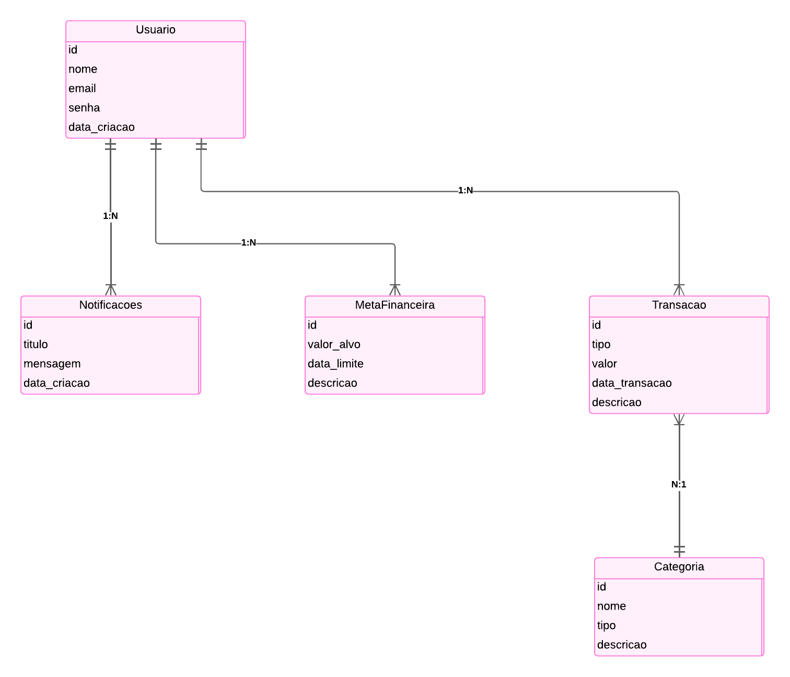

<!-- Capa do Projeto -->

    

# Conta Certa

    <strong>O dinheiro parece sumir ao longo do mês sem explicação?</strong> O Conta Certa foi criado para ajudar você a controlar suas finanças de forma simples e eficiente, proporcionando mais <strong>segurança</strong> e <strong>organização</strong> no seu dia a dia

---

    

---

## Problematização

Você já se perguntou <strong>para onde vai seu dinheiro</strong> no final do mês? A falta de <strong>controle financeiro</strong> afeta milhões de pessoas, levando ao endividamento e à dificuldade de alcançar metas financeiras. Quando não sabemos exatamente para onde vai nosso dinheiro, acabamos <strong>gastando mais do que podemos</strong>, o que gera preocupação e estresse constantes.

<blockquote style="font-size: 1.1rem;">
> Sabia que cerca de <strong>60% dos brasileiros</strong> não conseguem pagar as contas em dia?
</blockquote>
 

O principal <strong>desafio está em acompanhar os gastos diários e mensais</strong> de forma organizada — e é exatamente aí que o <q>Conta Certa</q> entra em ação!

    <a href="https://agenciadenoticias.ibge.gov.br/agencia-noticias/2012-agencia-de-noticias/noticias/31401-72-4-dos-brasileiros-vivem-em-familias-com-dificuldades-para-pagar-as-contas">Fonte: IBGE</a>

---

    

---

## Solução: Controle Financeiro Simplificado

Diante desse cenário, criei o <strong>Conta Certa</strong>, um sistema que <strong>ajuda a organizar as finanças</strong> de forma prática e intuitiva. Com ele, é possível:

<ul style="font-size: 1.1rem;">
  <li><strong>Registrar e centralizar todas as transações rapidamente</strong>, mantendo um histórico organizado.</li>
  <li><strong>Categorizar cada despesa e receita</strong>, facilitando a identificação dos principais gastos.</li>
  <li><strong>Obter relatórios detalhados</strong> que mostram tendências e possíveis ajustes no orçamento.</li>
  <li><strong>Definir metas financeiras</strong> para acompanhar o progresso e manter o foco em objetivos financeiros.</li>
</ul>

<blockquote style="font-size: 1.1rem;">
> <strong>Observação</strong>: A solução ainda está em nível conceitual, detalhada em diagrama ER e conceitual, mas não implementada como aplicação funcional.
</blockquote>

---

    

---

## Diagrama Conceitual

Para dar forma à ideia do sistema de maneira clara e organizada, desenvolvi um <strong>diagrama conceitual</strong> que mapeia as principais entidades e seus relacionamentos, sem entrar nos detalhes técnicos da implementação.

### Entidades do Sistema:

<ul style="font-size: 1.1rem;">
  <li><strong>Usuário</strong>: Armazena informações do usuário, como nome, e-mail e senha.</li>
  <li><strong>Transação</strong>: Representa uma movimentação financeira categorizada em despesa ou receita.</li>
  <li><strong>Categoria</strong>: Classifica transações para melhor organização.</li>
  <li><strong>MetaFinanceira</strong>: Define objetivos financeiros a serem alcançados.</li>
  <li><strong>Notificações</strong>: Envia alertas relacionados às finanças.</li>
</ul>

O diagrama conceitual abaixo representa a estrutura geral do sistema, exibindo as entidades e como elas se relacionam.

---

    

    <em>O diagrama conceitual acima representa a relação entre as entidades, demonstrando como as informações se conectam no sistema "Conta Certa".</em>

---

### Explicação dos Relacionamentos

  <ol>
    <li><strong>Usuário → Transação (1:N)</strong>
      <ul>
        <li>Um usuário pode registrar várias transações, mas cada transação pertence a um único usuário.</li>
      </ul>
    </li>
    <li><strong>Transação → Categoria (N:1)</strong>
      <ul>
        <li>Cada transação pertence a uma única categoria, mas uma categoria pode ter várias transações associadas.</li>
      </ul>
    </li>
    <li><strong>Usuário → MetaFinanceira (1:N)</strong>
      <ul>
        <li>Um usuário pode definir várias metas financeiras.</li>
      </ul>
    </li>
    <li><strong>Usuário → Notificações (1:N)</strong>
      <ul>
        <li>Um usuário pode receber várias notificações.</li>
      </ul>
    </li>
  </ol>

Esses relacionamentos garantem que os dados fiquem bem organizados e estruturados para fornecer uma visão clara do fluxo financeiro do usuário.

---

    

---

## Diagrama ER

Com base no modelo conceitual, desenvolvi o <strong>diagrama de entidade e relacionamento (ER)</strong> para oferecer uma visão detalhada do banco de dados, incluindo atributos, tipos de dados e relações entre as tabelas.

Esse modelo é essencial para a implementação eficiente e segura do sistema.

### Entidades e seus Atributos

No diagrama ER, cada entidade possui seus respectivos atributos com os tipos de dados adequados.

---

    

    <em>O diagrama acima detalha as tabelas, atributos e relações que compõem o banco de dados do sistema "Conta Certa".</em>

---

### A Importância do Modelo ER

  
O diagrama de Entidade-Relacionamento (ER) é essencial para transformar a ideia do sistema em uma estrutura funcional de banco de dados. Ele define a organização dos dados, os relacionamentos entre as entidades e garante a consistência das informações.

  
Com o modelo ER, a implementação se torna mais eficiente, reduzindo erros e facilitando consultas, além de fornecer uma base sólida para futuras expansões do sistema.

---

    

---

## Conclusão

  Criar o projeto <strong>Conta Certa</strong> foi uma experiência desafiadora e transformadora. Durante o curso de full-stack da <strong>Programadores do Amanhã</strong>, no módulo 3 de MySQL, tive a oportunidade de desenvolver diagramas conceituais e ER do zero, compreendendo na prática a importância da modelagem de dados para garantir um sistema eficiente e escalável.

  A criação do diagrama ER com a ferramenta <strong>dbdiagram.io</strong> foi essencial para visualizar a estrutura do banco de dados, identificar inconsistências e organizar os relacionamentos de forma eficiente. Esse processo reforçou como uma boa modelagem facilita o desenvolvimento e previne problemas futuros.

  O aprendizado adquirido nesse projeto fortaleceu minhas habilidades de análise e estruturação de sistemas, contribuindo para minha evolução como desenvolvedor full-stack.

---

  <strong>Gostou do projeto? Deixe uma estrela no repositório e sinta-se à vontade para usar o modelo que criei para gerenciar melhor o seu orçamento!</strong>

